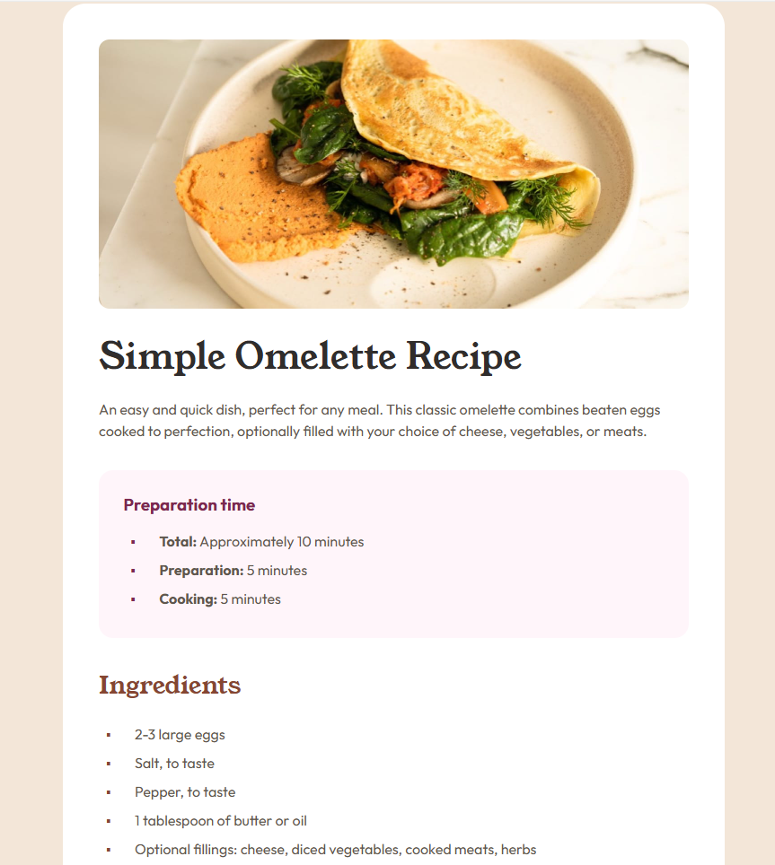

# Frontend Mentor - Recipe page solution

This is a solution to the [Recipe page challenge on Frontend Mentor](https://www.frontendmentor.io/challenges/recipe-page-KiTsR8QQKm).

## Table of contents

- [Overview](#overview)
  - [The challenge](#the-challenge)
  - [Screenshot](#screenshot)
  - [Links](#links)
- [My process](#my-process)
  - [Built with](#built-with)
  - [What I learned](#what-i-learned)
- [Author](#author)

## Overview

### The challenge

The challenge was to build a responsive recipe page based on two images provided: one for desktop version and another for mobile version.

### Screenshot

### Links

- Solution URL: https://polishko.github.io/practice/Front_End_Mentor/recipe-page-main/index.html

## My process

- First I wrote the html.
- Then I used the provided images in Figma, where I measured the containers and checked the colors.
- Then I styled each component.

### Built with

- Semantic HTML5 markup
- CSS custom properties
- Figma

### What I learned

I learned about variable fonts and had a reminder of some basic html and css concepts.

## Author

- GitHub - [Polishko](https://github.com/Polishko/Polishko)
- Frontend Mentor - [Fron End Mentor Profile] (https://www.frontendmentor.io/profile/Polishko)
- Portfolio - [Current Portfolio Page](https://d14e0564.portfolio-dxw.pages.dev/)
